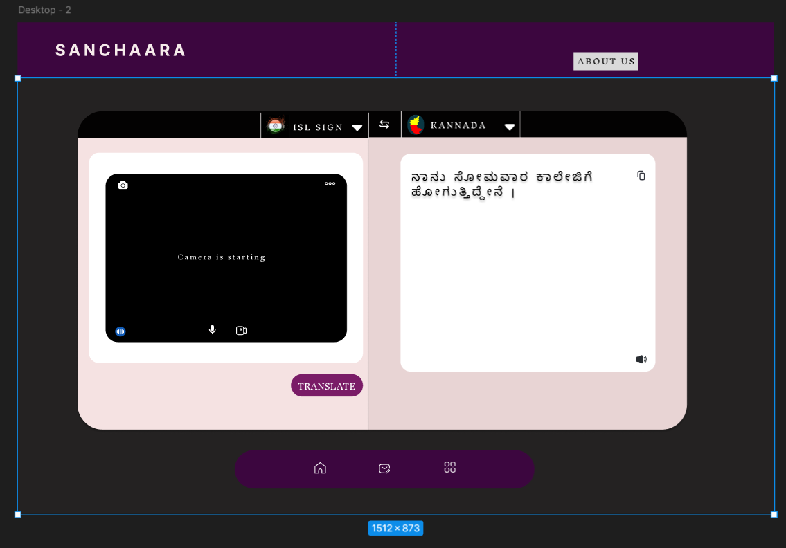

# README

## Project Title: Bidirectional Indian Sign Language (ISL) Translation System

### Prototype Link

Access our prototype here: [Figma Prototype](https://www.figma.com/proto/7jjMnYQO5LnuSBGPc5xvoo/Untitled?node-id=2-3\&p=f\&t=eDq058GgoMeiPMlA-0\&scaling=min-zoom\&content-scaling=fixed\&page-id=0%3A1\&starting-point-node-id=2%3A3)

---

## Abstract

Communication barriers between individuals who use Indian Sign Language (ISL) and those who rely on spoken or written language pose significant challenges, particularly in domains such as education, healthcare, and social integration. This project proposes an advanced system that bridges this gap by enabling seamless bidirectional translation between ISL and English, with added support for regional languages like Kannada.

Our solution integrates:

- **Computer Vision** for real-time ISL gesture recognition
- **Natural Language Processing (NLP)** for accurate grammatical conversions

The system translates sign language into text or speech and vice versa, adhering to ISL grammar rules and accommodating regional linguistic nuances. Innovative features such as dynamic gesture recognition using LSTM, real-time non-manual signal interpretation, and animated sign output ensure a comprehensive and user-friendly experience. The solution addresses gaps in existing systems by incorporating a dictionary-based approach for ISL sign matching and synonym replacement.

This project aspires to empower individuals with hearing and speech disabilities by making technology more accessible, fostering inclusion, and enabling equitable communication across diverse linguistic landscapes.

---

## Approach

Our approach involves developing an advanced translation system that integrates cutting-edge technologies to enable real-time bidirectional communication. The solution includes:
 

---

## Problem Statement

Communication between ISL users and individuals relying on spoken or written language is fraught with barriers, leading to social exclusion and limited access to essential services. Current solutions are inadequate in addressing the following issues:

1. **Unidirectional Translation Systems**:

   - Most systems either translate sign language to text or vice versa but do not provide seamless two-way communication.

2. **Neglect of ISL Grammar**:

   - Sign languages like ISL have unique grammatical structures that are often overlooked, resulting in inaccurate translations that fail to convey context effectively.

3. **Non-Manual Features Ignored**:

   - Facial expressions and body postures, essential components of ISL, are not accounted for in most solutions, reducing translation accuracy.

4. **Lack of Regional Language Support**:

   - India’s linguistic diversity is not adequately addressed, limiting accessibility for regional language users like Kannada speakers.

5. **Complexity and Accessibility**:

   - Existing systems require complex setups or typing, which are not user-friendly for ISL users who rely on gestures for communication.

---

## Key Features

- **Bidirectional Translation**: Real-time communication in both directions between ISL and text/speech.
- **Grammar-Adhering Translations**: Ensures grammatically correct ISL translations.
- **Dynamic Gesture Recognition**: Identifies static and dynamic gestures, including non-manual signals.
- **Regional Language Integration**: Supports Kannada and potentially other regional languages.
- **User-Friendly Interface**: Simplified setup and intuitive interaction for all users.

---

Your project’s uniqueness lies in several innovative aspects that address existing gaps and enhance inclusivity for Indian Sign Language (ISL) users. Here are the key points of uniqueness:  

### 1. **Bidirectional Translation**
   - Most existing systems focus on unidirectional translation, either converting sign language to text or text to sign language. Your project bridges this gap by enabling seamless two-way communication, allowing both ISL users and non-ISL users to interact naturally.

### 2. **ISL Grammar Adherence**
   - Unlike generic sign language translators, your solution respects the unique grammatical structure of ISL, ensuring translations that are contextually and grammatically accurate. This is crucial for conveying meaning effectively.

### 3. **Regional Language Support**
   - Incorporating regional languages like Kannada sets your project apart, addressing the linguistic diversity in India. This inclusion expands accessibility and relevance across different user demographics.

### 4. **Real-Time Animated Sign Outputs**
   - Your project includes animated sign outputs for text or speech, which is not only user-friendly but also an excellent tool for teaching and learning ISL, bridging communication gaps for learners and native users alike.

### 5. **Comprehensive User Accessibility**
   - Your solution minimizes complexity by eliminating the need for extensive typing or setup, making it highly accessible to users who primarily rely on gestures for communication.

---
### Output

---
## Contact and Contribution

We welcome contributions and feedback to improve the system. For further inquiries or to participate in the project, please reach out to the development team.

Allan Dsouza\
Swathi S\
Swaroop K R\
Sarah Catherine\

